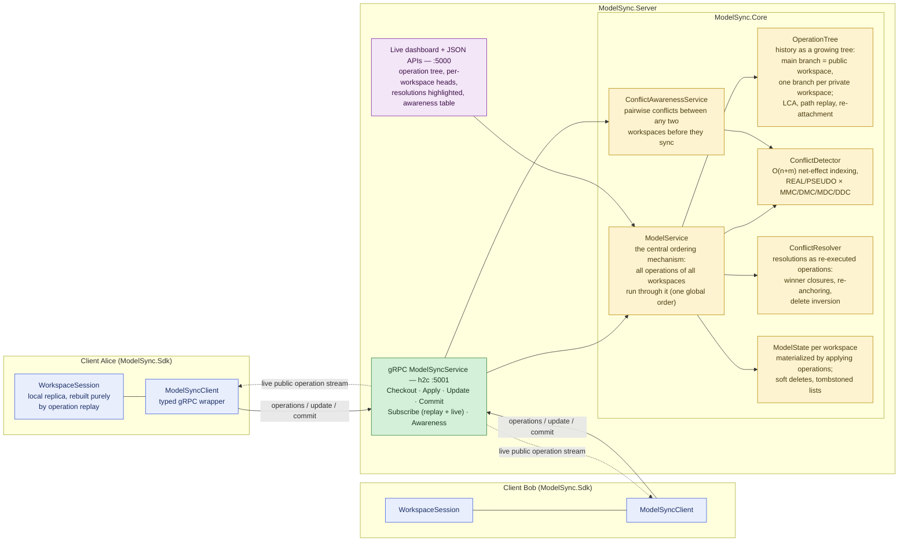
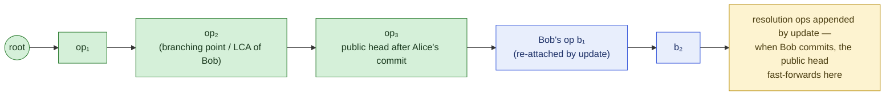

# Architecture

ModelSync is "Google Docs for models": any number of clients edit models — and
their metamodels — concurrently; a central server keeps every replica
convergent through incremental operations only.

## System overview

## The operation history is a growing tree

Workspaces form a **star**: every private workspace branches off the public
branch and rejoins it through update/commit. Replaying any branch from the
root reproduces that workspace's model exactly.

- **Checkout** creates a branch at the current public head and materializes
  the model by replaying the branch path.
- **Apply** validates one new operation against the workspace's current model,
  executes it and appends it to the branch.
- **Update** computes both deltas from the LCA, detects conflicts between
  them, replays the public delta, **re-executes the local delta** (so the live
  model equals the branch replay order), re-attaches the branch onto the
  public head and appends deterministic resolution operations.
- **Commit** is fast-forward only: the public branch replays the private delta
  — the private operations concatenated with their resolutions — and the
  public head moves to the private head.

Because every replica ends up executing the same operation sequence in the
same order, all replicas converge — including soft-deleted (tombstone) state.
See [list-synchronization.md](list-synchronization.md) for the list algorithm
and [conflict-catalog.md](conflict-catalog.md) for every conflict and its
outcome.

## Projects

| Project | Role |
|---|---|
| `src/ModelSync.Core` | Model state, operations, operation tree, conflict detection/resolution, awareness — no I/O. |
| `src/ModelSync.Server` | gRPC service (:5001) + live dashboard and JSON APIs (:5000); opt-in demo seeder. |
| `src/ModelSync.Sdk` | `ModelSyncClient` + `WorkspaceSession`: typed incremental edit API over a replayed local replica. |
| `src/ModelSync.Exploration` | Reusable state-space explorer + DOT/Mermaid graph generator for docs and paper figures. |
| `tests/ModelSync.Tests` | Unit, scenario, E2E, exhaustive DFS exploration and randomized property tests. |
| `benchmarks/ModelSync.Benchmarks` | BenchmarkDotNet suites: detection, sync round, replay scalability. |
