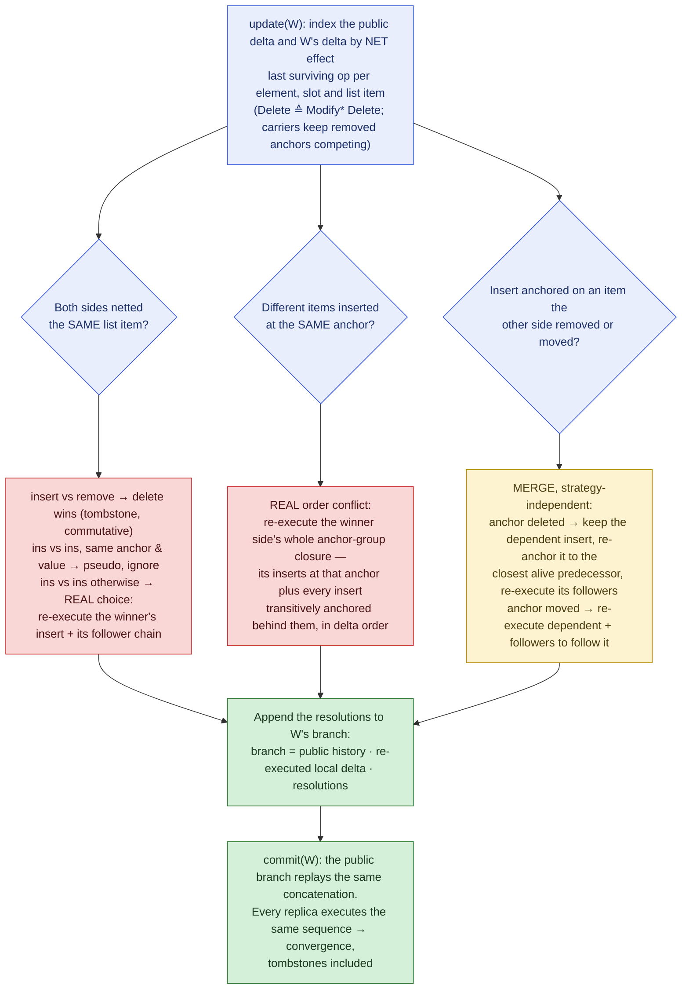

# List synchronization: conflicts and resolutions

This document explains how ModelSync keeps *ordered lists* convergent across
the star topology, under the one hard rule of the whole system: **a workspace
can only ever change by executing new incremental operations**. There is no
state upload, no "overwrite with my copy" — every fix, including conflict
resolution, must itself be an operation appended to a branch.

## The setting

- One **public workspace** `P` and any number of private workspaces. The
  operation history is a single growing **tree**: the main branch is `P`,
  every other branch is one private workspace.
- **Update** = pull: the private branch replays the public delta since the
  branching point (LCA), is re-attached onto the public head, and appends
  **resolution operations** for every non-commutative conflict.
- **Commit** = push (fast-forward only): the public branch replays the private
  delta — which is exactly *the private operations concatenated with their
  resolutions* — and the public head moves to the private head.
- A model **is** the replay of its branch: checking out any workspace fresh
  and replaying its path from the root must reproduce the live state
  operation by operation.

## Why lists are the hard part

Single values, sets and maps are *keyed* slots: the last writer of a key wins,
so one re-executed winner operation per contested key restores convergence.
Lists are different — an insert's meaning depends on its *position*, and
positions are expressed relative to other items that may themselves be
inserted, moved or removed concurrently.

## Representation: stable ids, anchors, tombstones

Three representation choices make deterministic list merging possible:

1. **Stable item ids.** Every list item gets an id at insert time that never
   changes, independent of value and position. Operations reference ids, not
   indexes — an index would silently point at a different item after a
   concurrent edit.
2. **Anchor-based inserts.** `InsertListItem(item, value, after)` places the
   item *after* an anchor item (`after = null` means the head). Executing an
   insert whose item already exists **relinks (moves)** it behind the anchor
   and re-asserts its value. Re-execution is therefore not a duplicate — it is
   a deterministic "put it back here", which is exactly what a resolution
   needs.
3. **Tombstones.** Removing an item only marks its node deleted; the node
   stays in the chain. Later operations anchored on the removed item stay
   executable (they land after the tombstone, i.e. at its old position), and a
   re-inserted removed item stays dead — **delete always wins** for list
   items, on every replica, in every replay order.

## Detection: net effects, then three questions

When a workspace updates, the public delta and the private delta since the
LCA are each indexed by their **net effect** — the last surviving operation
per element, per keyed slot, and per list item (the thesis rule
*Delete ≙ Modify\* Delete*: a branch is classified by where it ended up, not
by every intermediate step). Net inserts are additionally grouped by their
anchor. A removed item whose position still carries surviving followers (a
"carrier") keeps competing at its anchor so those followers aren't orphaned.

Detection then joins the two indexes and asks, in O(n + m):

| Question | Conflict | Class |
|---|---|---|
| Did both sides net-operate on the **same item**? | insert/move vs. insert/move: same anchor & value → pseudo; otherwise a real binary choice. Insert vs. remove → pseudo (delete wins, commutative under tombstones). Remove vs. remove → pseudo. | `ListOrder` |
| Did both sides net-insert **different items at the same anchor**? | The interleaving is ambiguous — a real choice between "my sequence first" and "yours first". | `ListOrder` |
| Did one side insert **after an item the other side removed or moved**? | The dependent insert must follow its anchor's fate; no winner to pick, but a merge action is required. | `ListAnchorDeleted` / `ListAnchorMoved` |

## Resolution: re-execute the winner's closure

A resolution is never a diff of states — it is a set of **new operations**
(clones of existing ones, marked as resolutions) appended to the updating
branch. Because inserting an existing item *moves* it, re-executing an insert
sequence deterministically re-asserts that sequence's order on any replica,
regardless of what happened in between. Concretely:

- **Same anchor, competing inserts** — take the winner side (child or parent
  by strategy) and re-execute its whole **anchor group closure**: the winner's
  inserts at that anchor *plus every insert transitively anchored behind
  them*, in the winner delta's original order. Re-executing the closure and
  not just one operation is what keeps whole inserted sequences (`U, V`
  behind `X`) intact — this reproduces the thesis POC outcomes
  `[A, X, U, V, B, C]` (parent wins) and `[A, U, V, X, B, C]` (child wins).
- **Anchor deleted** — the dependent insert is kept, re-anchored onto the
  **closest alive predecessor** of the tombstoned anchor (or the head), and
  its follower chain is re-executed behind it. Position is preserved as
  closely as the surviving items allow.
- **Anchor moved** — the dependent insert and its followers are re-executed
  unchanged; since the anchor has a new position, re-execution makes the
  dependents follow it there.
- **Same item, placed differently** — re-execute the winning insert (with its
  followers); the losing placement is overridden because re-execution moves
  the item.
- **Insert vs. remove of the same item** — nothing to append: tombstones make
  the pair commutative and the removal wins by construction.

## Why every replica converges

The updating workspace's branch, after update, reads:

```
public history · re-executed local delta · resolutions
```

and this concatenation is *the* canonical order everywhere:

- the **updating workspace's live model** applies the public delta, then
  re-executes its own delta, then applies the resolutions — so its state
  equals its branch replay exactly;
- on **commit**, the public workspace executes the same local delta and the
  same resolutions on top of the same public history;
- every **other workspace** receives that history through its own later
  update;
- a **fresh checkout** replays the branch literally.

Same operations, same order, deterministic execution — same state. The
re-execution step is essential: the updating workspace executed its own edits
*before* it saw the public delta, but the branch says they come *after*.
Re-executing them (a no-op for commutative edits, a deterministic re-assertion
otherwise) realigns the live model with the replay order; the resolutions then
have the final word on every contested slot. This invariant is exercised
exhaustively by `DeepStateSpaceExplorationTests`, which from every reachable
state of a bounded list/star configuration (every insert position, every
removal, every commit/update interleaving, both winner strategies) asserts
that the public model, all private models and a fresh replay are identical —
including soft-deleted elements and tombstone state.

## The pipeline at a glance



## The thesis POC, step by step

Concurrent inserts at the same anchor: Alice (parent side, commits first)
inserts `X` after `A`; Bob (child side) inserts the sequence `U, V` after `A`.
Both sequences survive — the winner strategy only decides which sequence sits
directly behind the contested anchor:

```mermaid
flowchart LR
  classDef state fill:#e8eefc,stroke:#3b5bdb,color:#1c2f66;
  classDef confl fill:#f9d7d7,stroke:#c62828,color:#4a1414;
  classDef done fill:#d5f0d9,stroke:#2e7d32,color:#1b3a1f;

  B0["public base<br/>&#91;A B C&#93;"]:::state
  P1["Alice: ins X after A<br/>&#91;A X B C&#93;<br/>commit → public"]:::state
  C1["Bob: ins U after A, ins V after U<br/>&#91;A U V B C&#93;"]:::state
  M["Bob updates:<br/>replay public Δ, re-execute own Δ<br/>REAL list-order conflict:<br/>anchor group of A = {X} vs {U}"]:::confl
  W1["ChildWins resolution:<br/>re-execute U@A · V@U (Bob's closure)<br/>&#91;A U V X B C&#93;"]:::done
  W2["ParentWins resolution:<br/>re-execute X@A (Alice's closure)<br/>&#91;A X U V B C&#93;"]:::done

  B0 --> P1 --> M
  B0 --> C1 --> M
  M -->|child wins| W1
  M -->|parent wins| W2
```



Because executing an insert of an existing item *moves* it, the winner-closure
re-execution produces the same final order on Bob's replica, on the public
branch after Bob commits, on Alice's replica after her next update, and in any
fresh replay — these are the two outcomes `[A,U,V,X,B,C]` / `[A,X,U,V,B,C]`
asserted by `SyncScenarioTests`.

## The explored list state space

The transition system below is **generated** by the exploration tool from the
paper-sized scenario (public list starts empty, Alice can add `x`, Bob can add
`y`, depth 4): 39 reachable states, 54 transitions. Green = in sync, yellow =
diverged (a commit/update is required to merge), red = conflicted (a
resolution — a winner choice — is required to rejoin). `†` marks tombstones:
states that differ only in tombstones are distinct because tombstones anchor
future inserts. Regenerate with:

```bash
dotnet run --project src/ModelSync.Exploration -- all --out docs/figures
# paper figures: dot -Tpdf docs/figures/state-space-paper-list.dot -o figure.pdf
```

The full graphs (601 list states, 1 995 mixed-cardinality states) are too
large to stay readable in the repository; the command above regenerates their
Graphviz DOT and Mermaid sources into `docs/figures/` in well under a second.

```mermaid
flowchart TD
  classDef insync fill:#d5f0d9,stroke:#2e7d32,color:#1b3a1f;
  classDef diverged fill:#fdf3d0,stroke:#b58900,color:#4a3d10;
  classDef conflicted fill:#f9d7d7,stroke:#c62828,color:#4a1414;
  S0["P:&#91;&#93; A:&#91;&#93; B:&#91;&#93;"]:::insync
  S1["P:&#91;&#93; A:&#91;x&#93;↑1↓0 B:&#91;&#93;"]:::diverged
  S2["P:&#91;&#93; A:&#91;†x&#93;↑2↓0 B:&#91;&#93;"]:::diverged
  S3["P:&#91;&#93; A:&#91;†x&#93;↑2↓0 B:&#91;y&#93;↑1↓0"]:::diverged
  S4["P:&#91;&#93; A:&#91;†x&#93;↑2↓0 B:&#91;†y&#93;↑2↓0"]:::diverged
  S5["P:&#91;†x&#93; A:&#91;†x&#93; B:&#91;y&#93;↑1↓2"]:::diverged
  S6["P:&#91;y&#93; A:&#91;†x&#93;↑2↓1 B:&#91;y&#93;"]:::diverged
  S7["P:&#91;†x&#93; A:&#91;†x&#93; B:&#91;&#93;↑0↓2"]:::diverged
  S8["P:&#91;†x&#93; A:&#91;†x&#93; B:&#91;†x&#93;"]:::insync
  S9["P:&#91;&#93; A:&#91;x&#93;↑1↓0 B:&#91;y&#93;↑1↓0"]:::diverged
  S10["P:&#91;&#93; A:&#91;x&#93;↑1↓0 B:&#91;†y&#93;↑2↓0"]:::diverged
  S11["P:&#91;x&#93; A:&#91;x&#93; B:&#91;†y&#93;↑2↓1"]:::diverged
  S12["P:&#91;†y&#93; A:&#91;x&#93;↑1↓2 B:&#91;†y&#93;"]:::diverged
  S13["P:&#91;x&#93; A:&#91;x&#93; B:&#91;y&#93;↑1↓1"]:::conflicted
  S14["P:&#91;x&#93; A:&#91;†x&#93;↑1↓0 B:&#91;y&#93;↑1↓1"]:::conflicted
  S15["P:&#91;x&#93; A:&#91;x&#93; B:&#91;y x&#93;↑2↓0"]:::diverged
  S16["P:&#91;x&#93; A:&#91;x&#93; B:&#91;x y&#93;↑2↓0"]:::diverged
  S17["P:&#91;y&#93; A:&#91;x&#93;↑1↓1 B:&#91;y&#93;"]:::conflicted
  S18["P:&#91;y&#93; A:&#91;x&#93;↑1↓1 B:&#91;†y&#93;↑1↓0"]:::conflicted
  S19["P:&#91;y&#93; A:&#91;x y&#93;↑2↓0 B:&#91;y&#93;"]:::diverged
  S20["P:&#91;y&#93; A:&#91;y x&#93;↑2↓0 B:&#91;y&#93;"]:::diverged
  S21["P:&#91;x&#93; A:&#91;x&#93; B:&#91;&#93;↑0↓1"]:::diverged
  S22["P:&#91;x&#93; A:&#91;†x&#93;↑1↓0 B:&#91;&#93;↑0↓1"]:::diverged
  S23["P:&#91;x&#93; A:&#91;†x&#93;↑1↓0 B:&#91;x&#93;"]:::diverged
  S24["P:&#91;x&#93; A:&#91;x&#93; B:&#91;x&#93;"]:::insync
  S25["P:&#91;x&#93; A:&#91;x&#93; B:&#91;y x&#93;↑1↓0"]:::diverged
  S26["P:&#91;x&#93; A:&#91;x&#93; B:&#91;x y&#93;↑1↓0"]:::diverged
  S27["P:&#91;x&#93; A:&#91;x&#93; B:&#91;†x&#93;↑1↓0"]:::diverged
  S28["P:&#91;&#93; A:&#91;&#93; B:&#91;y&#93;↑1↓0"]:::diverged
  S29["P:&#91;&#93; A:&#91;&#93; B:&#91;†y&#93;↑2↓0"]:::diverged
  S30["P:&#91;†y&#93; A:&#91;&#93;↑0↓2 B:&#91;†y&#93;"]:::diverged
  S31["P:&#91;†y&#93; A:&#91;†y&#93; B:&#91;†y&#93;"]:::insync
  S32["P:&#91;y&#93; A:&#91;&#93;↑0↓1 B:&#91;y&#93;"]:::diverged
  S33["P:&#91;y&#93; A:&#91;&#93;↑0↓1 B:&#91;†y&#93;↑1↓0"]:::diverged
  S34["P:&#91;y&#93; A:&#91;y&#93; B:&#91;†y&#93;↑1↓0"]:::diverged
  S35["P:&#91;y&#93; A:&#91;y&#93; B:&#91;y&#93;"]:::insync
  S36["P:&#91;y&#93; A:&#91;x y&#93;↑1↓0 B:&#91;y&#93;"]:::diverged
  S37["P:&#91;y&#93; A:&#91;y x&#93;↑1↓0 B:&#91;y&#93;"]:::diverged
  S38["P:&#91;y&#93; A:&#91;†y&#93;↑1↓0 B:&#91;y&#93;"]:::diverged
  S3 -->|"B:rm:y"| S4
  S3 -->|"A:commit"| S5
  S3 -->|"B:commit"| S6
  S2 -->|"B:ins:y@head"| S3
  S7 -->|"B:ins:y@head"| S5
  S7 -->|"B:update"| S8
  S2 -->|"A:commit"| S7
  S1 -->|"A:rm:x"| S2
  S9 -->|"A:rm:x"| S3
  S10 -->|"A:rm:x"| S4
  S10 -->|"A:commit"| S11
  S10 -->|"B:commit"| S12
  S9 -->|"B:rm:y"| S10
  S13 -->|"A:rm:x"| S14
  S13 -->|"B:rm:y"| S11
  S13 -->|"B:update:child-wins"| S15
  S13 -->|"B:update:parent-wins"| S16
  S9 -->|"A:commit"| S13
  S17 -->|"A:rm:x"| S6
  S17 -->|"B:rm:y"| S18
  S17 -->|"A:update:child-wins"| S19
  S17 -->|"A:update:parent-wins"| S20
  S9 -->|"B:commit"| S17
  S1 -->|"B:ins:y@head"| S9
  S22 -->|"B:ins:y@head"| S14
  S22 -->|"A:commit"| S7
  S22 -->|"B:update"| S23
  S21 -->|"A:rm:x"| S22
  S21 -->|"B:ins:y@head"| S13
  S24 -->|"A:rm:x"| S23
  S24 -->|"B:ins:y@head"| S25
  S24 -->|"B:ins:y@x"| S26
  S24 -->|"B:rm:x"| S27
  S21 -->|"B:update"| S24
  S1 -->|"A:commit"| S21
  S0 -->|"A:ins:x@head"| S1
  S28 -->|"A:ins:x@head"| S9
  S29 -->|"A:ins:x@head"| S10
  S30 -->|"A:ins:x@head"| S12
  S30 -->|"A:update"| S31
  S29 -->|"B:commit"| S30
  S28 -->|"B:rm:y"| S29
  S32 -->|"A:ins:x@head"| S17
  S33 -->|"A:ins:x@head"| S18
  S33 -->|"A:update"| S34
  S33 -->|"B:commit"| S30
  S32 -->|"B:rm:y"| S33
  S35 -->|"A:ins:x@head"| S36
  S35 -->|"A:ins:x@y"| S37
  S35 -->|"A:rm:y"| S38
  S35 -->|"B:rm:y"| S34
  S32 -->|"A:update"| S35
  S28 -->|"B:commit"| S32
  S0 -->|"B:ins:y@head"| S28
```

<!-- GENERATED: docs/figures/state-space-paper-list.mmd (front-matter stripped) -->


## See also

- [conflict-catalog.md](conflict-catalog.md) — every possible conflict of the
  current metamodel with its outcome per winning side.
- [architecture.md](architecture.md) — how clients, server, operation tree and
  the conflict machinery fit together.
